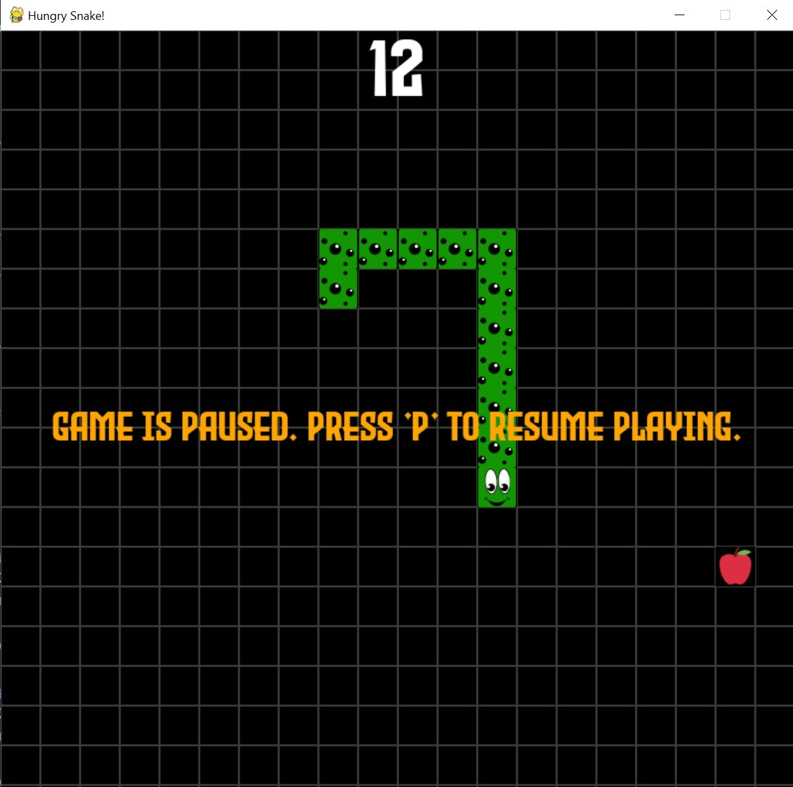

# Hungry Snake

## Description

Hungry Snake is a classic snake game built using Python and Pygame library. Control the snake to eat apples and grow longer while avoiding collisions with walls and itself. The game features realistic collision effects and a pause function for convenience.

## Features

- Simple and intuitive controls.
- Realistic collision effects.
- Pause function for convenience.
- Increasing difficulty as the snake grows longer.
- High score tracking.

## How to Play

1. Clone or download the repository.
2. Make sure you have Python and Pygame library installed on your system.
3. Run the `main.py` file to start the game.
4. Use arrow keys to control the direction of the snake.
5. Eat apples to grow longer and avoid collisions with walls and yourself.
6. Press "P" to pause the game.

## Screenshots

## Dependencies

- Python 3.x
- Pygame library

## License

This project is licensed under the [MIT License](LICENSE).

